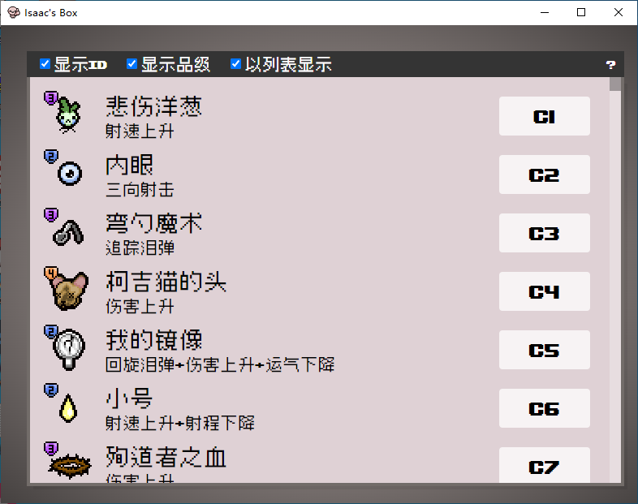
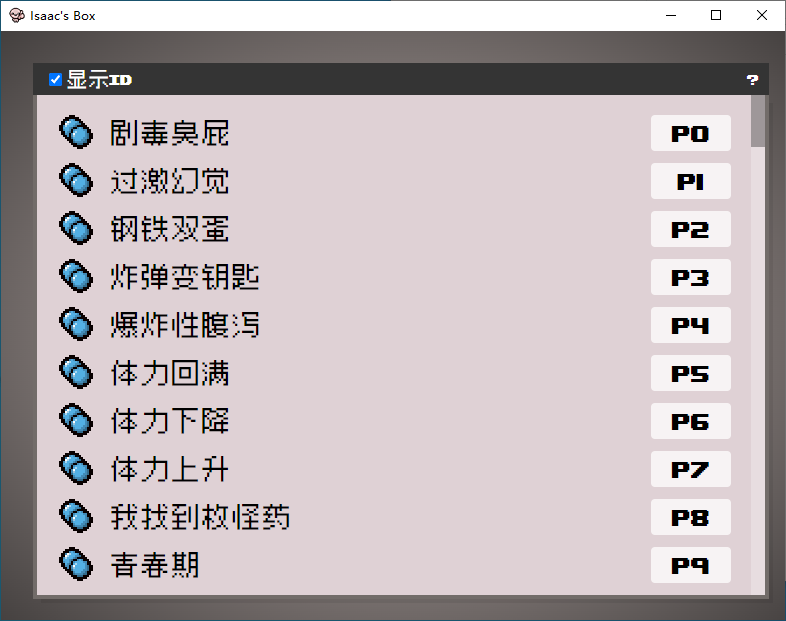
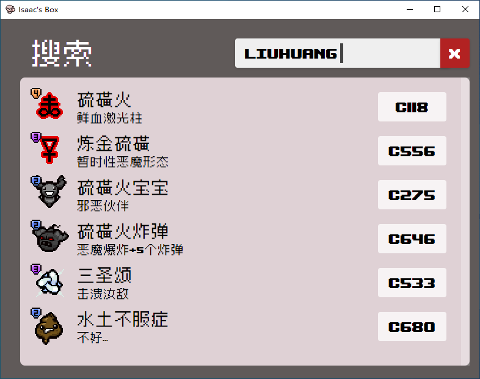

# Isaac Box 以撒的盒子

这是一个基于[IsaacSocket](https://github.com/LanbingIce/IsaacSocket-Mod)的外置控制台，基于Vue3+electron,通过WS与IsaacSocket进行连接，需要配合IsaacBox Mod来达到一个外置控制台的目的。

## 使用方法(如果您仅仅是一个使用者)
1. 在[release](https://github.com/NOTF-API/IsaacBoxClient/releases/)页面或者其他途径下载最新版本的IsaacBox Client(以撒的盒子客户端)
2. 以前安装过相关Mod(IsaacBox与IsaacSocket)的请您手动删除这两个Mod。
3. 解压缩文件夹，打开isaac-box.exe。
4. 启动游戏,如果未安装所需Mod，则会自动安装，安装完毕后会要求您重新手动启动游戏。（仅会在第一次启动时安装）
5. 新游戏/继续游戏后 控制台输出IsaacBox即可正常使用。

## 遇到问题
+ 一使用就暂停？

+ 请检查是否曾经安装过IsaacSocket，同一时间只能开启一个IsaacSocket MOD，请手动删除或者在MOD菜单中禁用

+ 检查是否被杀毒软件拦截或者限制访问了
+ 如果不能为您自动安装mod，请手动复制dependencies下的两个mod至游戏MOD文件夹。
+ 是否不能主动打开IsaacSocket.exe 可能需要安装.net环境
+ 如果不能为您自动启动IsaacSocket.exe，请在每次游戏前手动运行dependencies/IsaacSocketUtility下的IsaacSocket.exe
+ 参考https://github.com/LanbingIce/IsaacSocket-Mod 文档
+ 或者提issue

## 功能图

## 目前已有功能
+ 显示与移除身上的道具
+ 道具生成/给予
+ 饰品生成/给予
+ 卡牌/符文 生成/给予
+ 给予药丸/大药丸
+ 全局搜索
+ debug开关
+ 楼层
+ 八国语言支持(简中,英,德,法,俄,日,韩,西班牙)

## 项目使用(普通用户无需关注,开发者需关注)
+ 首先安装相关依赖(推荐npm) 命令为:npm install
+ npm run dev:网页开发调试 调试界面和基础功能用这个
+ npm run build:生成静态网页
+ npm run start:生成静态网页并运行electron 模拟真实使用环境 调试WebSocket用这个
+ npm run make:打包生成用户可以一键运行的安装包
## 未完成功能
+ 目前仅支持中英双语的全局搜索,并且拼音缩写搜索目前只支持卡牌和符文与胶囊

## 特别感谢
(不区分先后顺序)

[LanbingIce](https://github.com/LanbingIce)

[enthusiasmgame2001](https://github.com/enthusiasmgame2001)

[白玉螳](https://space.bilibili.com/6126195)
