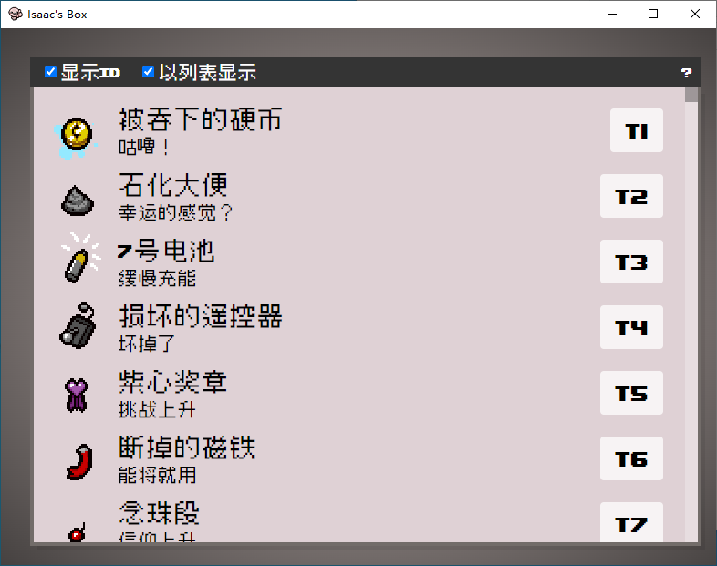

# Isaac Box 以撒的盒子

这是一个基于IsaacSocket的外置控制台，基于Vue3+electron,通过WS与IsaacSocket进行连接，需要配合IsaacBox Mod来达到一个外置控制台的目的。

## 目前已有功能
+ 道具生成/给予
+ 饰品生成/给予
+ 卡牌/符文 生成/给予
+ 给予药丸/大药丸
+ 全局搜索
+ debug开关
+ 楼层
+ 八国语言

## 使用方法
1. 在[release](https://github.com/NOTF-API/IsaacBoxClient/releases/)页面或者其他途径下载最新版本的IsaacBox Client(以撒的盒子客户端)
2. 解压缩文件夹，打开isaac-box.exe (会暂无界面)
3. 启动游戏,此时界面弹出。
4. 如果是第一次启动，会自动安装必要mod并自动关闭游戏，请您根据提示重新手动启动游戏。
5. 新游戏/继续游戏后 看到屏幕顶部的IsaacBox + 版本 即可开始正常使用。

## 遇到问题
+ 参考https://github.com/LanbingIce/IsaacSocket-Mod 文档
+ 请检查是否曾经安装过IsaacSocket，同一时间只能开启一个IsaacSocket MOD
+ 或者提issue

## 项目使用
+ 首先安装相关依赖(推荐npm) 命令为:npm install
+ npm run dev:网页开发调试 调试界面和基础功能用这个
+ npm run build:生成静态网页
+ npm run start:生成静态网页并运行electron 模拟真实使用环境 调试WebSocket用这个
+ npm run make:打包生成用户可以一键运行的安装包
## 待开发功能
+ 拥有道具的界面，可以移除道具
+ 部分语言未开发完毕

## 特别感谢
(不区分先后顺序)

[LanbingIce](https://github.com/LanbingIce)

[enthusiasmgame2001](https://github.com/enthusiasmgame2001)

[白玉螳](https://space.bilibili.com/6126195)
